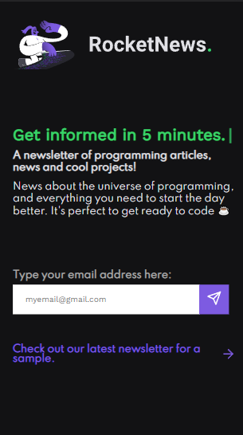

<h1 align="center">RocketNews - Rocketseat 👩‍💻🚀</h1>

### ⚠ About 

This project was developed using HTML, CSS and JavaScript based on the challenge <strong>"RocketNews"</strong> by Rocketseat. Besides, the project design was completely based on planning.

The purpose of creating this project is to practice the basic and necessary tools for building a responsive website: <strong>HTML</strong>, <strong>CSS</strong> (and a little bit of <strong>Javascript</strong>)!

 

<strong>Challenge planning:</strong>
<a href="https://efficient-sloth-d85.notion.site/Desafio-RocketNews-2e2c5d56b41f4b13a7d8df6b5affc0ec">RocketNews on Notion.</a>

<strong>Layout on Figma:</strong>
<a href="https://www.figma.com/file/eLSrCHRbbke9TKLdKi98Ib/DD-%2F-RocketNews-(Copy)">RocketNews on Figma.</a>

---
### 🛠 Techs

The following tools were used in the construction of the project:

 - [HTML](https://www.w3schools.com/html/)
 - [CSS](https://www.w3schools.com/css/)
 - [JavaScript](https://www.javascript.com/)

---

### 🌟 Features

- [x] E-mail registration (just design)
- [x] Responsive
  
   

  ### Desktop Version
  

  ### Mobile Version
  

 
<h4 align="center"> 
	 Project completed ✅
</h4>

---
### Author

 

<a href="https://blog.rocketseat.com.br/author/thiago/">
 
  
 <b>Leonardo Oliveira 🚀</b></a> 
 

Made with 💜 by Leonardo Oliveira 👋!

